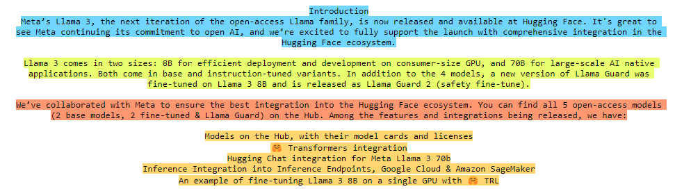
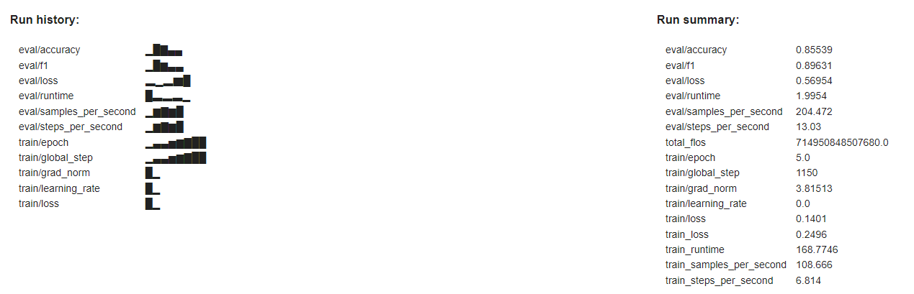

# Generative-AI-101

Annotated Notebooks to dive into foundational concepts and state-of-the-art techniques for LLMs and Diffusion models. This is a work in progress, more content will be released on a regular basis.

- [Generative-AI-101](#generative-ai-101)
  - [00. Transformers Self-Attention Mechanism](#00-transformers-self-attention-mechanism)
  - [01. In-Context Learning](#01-in-context-learning)
  - [02. LLM-Augmentation](#02-llm-augmentation)
  - [03. Retrieval Augmented Generation](#03-retrieval-augmented-generation)
  - [04. Knowledge Graphs](#04-knowledge-graphs)
  - [05. Fine-Tuning BERT](#05-fine-tuning-bert)
  - [06. Fine-Tuning ResNet](#06-fine-tuning-resnet)
  - [07. Model Optimization: Quantization](#07-model-optimization-quantization)

## 00. Transformers Self-Attention Mechanism

The Transformer architecture, introduced in 2017 by Google and University of Toronto researchers, revolutionized Natural Language Processing (NLP) with its innovative self-attention mechanism. This approach, which replaced traditional Recurrent Neural Networks (RNNs), allows models to learn contextual relationships between words regardless of their position in a sequence. By using attention weights to determine word relevance, Transformers have significantly improved training efficiency and inference accuracy in NLP tasks.

In this notebook, we'll explore how (multi-head) self-attention is implemented and visualize the patterns that are typically learned using [bertviz](https://pypi.org/project/bertviz/), an interactive tool for visualizing attention in Transformer models:

  

Self-Attention Visualization in the BERT model

`Transfomers` `Self-Attention` `BERT` `BertViz`

## 01. In-Context Learning

In Progress

## 02. LLM-Augmentation

In Progress

## 03. Retrieval Augmented Generation

Retrieval Augmented Generation (RAG) is an advanced NLP technique that enhances the quality and reliability of Large Language Models (LLMs) by grounding them in external knowledge sources. This approach combines information retrieval with text generation to produce more factual and specific responses. RAG works by retrieving relevant passages from a knowledge base based on a user query, augmenting the original prompt with this information, and then generating a response using both the query and the augmented context. This method offers several advantages, including improved accuracy, easy incorporation of updated knowledge, and enhanced interpretability through citation of retrieved passages.

In this notebook, we'll build a basic knowledge base with exemplary documents, apply chunking, index the embedded splits into a vector storage, and build a conversational chain with history.

  

Exemplary Document Chunking for a RAG-based Conversational Chain

`RAG` `Chunking` `FAISS` `Hugging Face Transformers` `LangChain` `Sentence-Transformers` `Groq` `Meta-Llama-3.1-8B`

## 04. Knowledge Graphs

In Progress

## 05. Fine-Tuning BERT

This notebook demonstrates the process of fine-tuning [BERT-base (Bidirectional Encoder Representations from Transformers)](https://arxiv.org/abs/1810.04805) for the Microsoft Research Paraphrase Corpus (MRPC) task, part of the General Language Understanding Evaluation (GLUE) benchmark. BERT-base is a transformer model pre-trained on a large corpus of English text using self-supervised learning. Its pre-training involves two key tasks: **Masked Language Modeling (MLM)**, where it predicts randomly masked words in a sentence, and **Next Sentence Prediction (NSP)**, where it determines if two sentences are consecutive in the original text. This approach allows BERT to learn bidirectional representations of language, capturing complex contextual relationships.

While BERT's pre-training provides a robust understanding of language, it requires fine-tuning on specific tasks to adapt its knowledge for particular applications. Besides MRPC, BERT can be fine-tuned for various NLP tasks such as sentiment analysis, named entity recognition, question answering, and text classification. This fine-tuning process leverages transfer learning, allowing the model to achieve high performance on specialized NLP tasks with limited datasets.

It's worth noting that while BERT is typically fine-tuned for specific downstream tasks, other language models like GPT (Generative Pre-trained Transformer) have been fine-tuned on instruction-following tasks. This enables models to understand and execute a wide range of natural language instructions, making them more versatile for general-purpose use. For the sake of simplicity, our BERT fine-tuning for MRPC will focus on the specific task of paraphrase identification.

  

BERT fine-tuned evaluation on GLUE-MRPC

`BERT` `Tokenization` `Dynamic-Padding` `Hugging Face Transformers` `Weights & Biases` `GLUE-Benchmark` 

## 06. Fine-Tuning ResNet

In Progress

## 07. Model Optimization: Quantization

