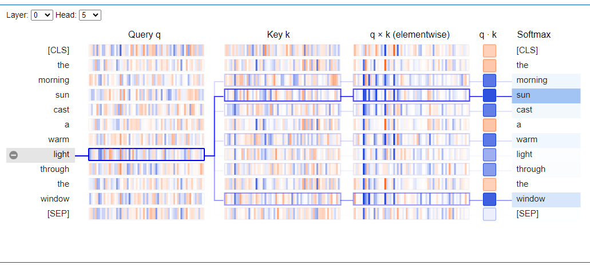
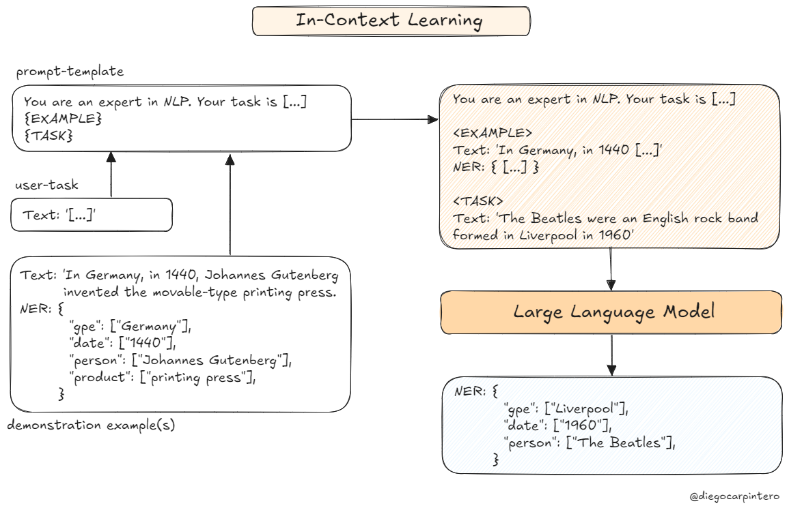
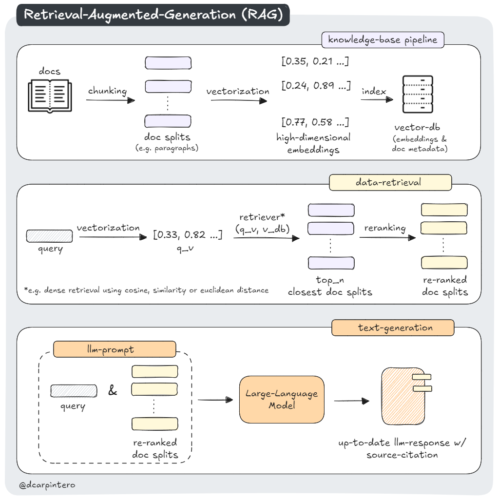
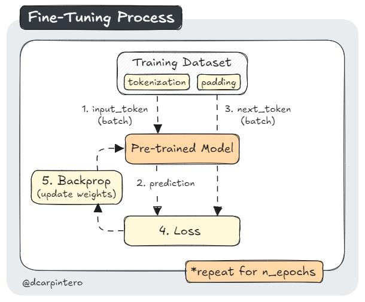
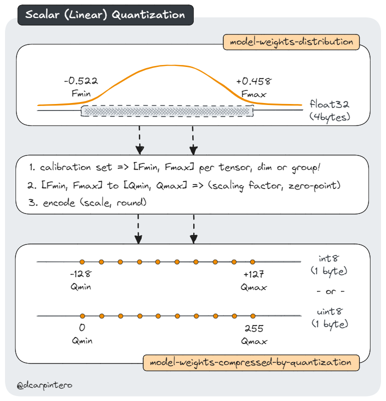

# Generative-AI-101

Annotated Notebooks to dive into foundational concepts and state-of-the-art techniques for LLMs and Diffusion models. This is a work in progress, more content will be released on a regular basis.

- [Generative-AI-101](#generative-ai-101)
  - [00. Transformers Self-Attention Mechanism](#00-transformers-self-attention-mechanism)
  - [01. In-Context Learning](#01-in-context-learning)
  - [02. LLM-Augmentation](#02-llm-augmentation)
  - [03. Retrieval Augmented Generation](#03-retrieval-augmented-generation)
  - [04. Knowledge Graphs](#04-knowledge-graphs)
  - [05. Fine-Tuning BERT](#05-fine-tuning-bert)
  - [06. Fine-Tuning ResNet](#06-fine-tuning-resnet)
  - [07. Model Optimization: Quantization](#07-model-optimization-quantization)

## 00. Transformers Self-Attention Mechanism

 

The Transformer architecture, introduced in 2017 by Google and University of Toronto researchers, revolutionized Natural Language Processing (NLP) with its innovative (multi-head) self-attention mechanism. This approach replaces traditional Recurrent Neural Networks (RNNs) and allows models to learn various types of contextual relationships between words regardless of their position in a sequence. By incorporating this mechanism into an encoder-decoder architecture, Transformers have significantly improved training efficiency and inference accuracy in NLP tasks.

In this notebook, we'll explore how (multi-head) self-attention is implemented and visualize the patterns that are typically learned using [bertviz](https://pypi.org/project/bertviz/), an interactive tool for visualizing attention in Transformer models:

  

Self-Attention Visualization in the BERT model

Tags: `[Transfomers]` `[Self-Attention]` `[BERT]` `[BertViz]`

## 01. In-Context Learning

`In-context learning (ICL)` enables large language models (LLMs) to perform tasks and generate responses based on the context provided at inference within the input prompt. In practice, the context comprises `one or a few demonstrations of an intended task that condition the model` and allow it to adapt to various tasks without requiring explicit fine-tuning or retraining. This notebook explores the concept of in-context learning, demonstrating how to enable an LLM to implement Named Entity Recognition (NER) to enrich a corpus with Wikipedia links. This flexible approach supports rapid adaptation to specific domains without requiring a large training dataset.

  

In-Context Learning

Tags: `[in-context learning]` `[named-entity-recognition]` `[function-calling]`
`[openai]`

*This notebook is also available at [openai/openai-cookbook/](openai/openai-cookbook/examples/Named_Entity_Recognition_to_enrich_text.ipynb)* - *[PR#807](https://github.com/openai/openai-cookbook/pull/807)*

## 02. LLM-Augmentation

In Progress

## 03. Retrieval Augmented Generation

Retrieval Augmented Generation (RAG) is an advanced NLP technique that enhances the quality and reliability of Large Language Models (LLMs). This approach combines information retrieval with text generation to produce more factual and specific responses. In practice, RAG works by retrieving relevant passages from a knowledge base based on a user query, augmenting the original prompt with this information, and then generating a response using both the query and the augmented context. This method offers several advantages, including improved accuracy, easy incorporation of updated knowledge, and enhanced interpretability through citation of retrieved passages.

In this notebook, we'll build a basic knowledge base with exemplary documents, apply chunking, index the embedded splits into a vector storage, and build a conversational chain with history.

  

Tags: `[RAG]` `[Chunking]` `[FAISS]` `[Hugging Face Transformers]` `[LangChain]` `[Sentence-Transformers]` `[Groq]` `[Meta-Llama-3.1-8B]`

## 04. Knowledge Graphs

In Progress

## 05. Fine-Tuning BERT

This notebook demonstrates the process of fine-tuning [BERT-base (Bidirectional Encoder Representations from Transformers)](https://arxiv.org/abs/1810.04805) for the Microsoft Research Paraphrase Corpus (MRPC) task, part of the [General Language Understanding Evaluation (GLUE)](https://gluebenchmark.com/) benchmark. BERT-base is a transformer model pre-trained on a large corpus of English text using self-supervised learning. Its pre-training involves two key tasks: **Masked Language Modeling (MLM)**, where it predicts randomly masked words in a sentence, and **Next Sentence Prediction (NSP)**, where it determines if two sentences are consecutive in the original text. This allows BERT to learn bidirectional representations of language, capturing complex contextual relationships.

While BERT's pre-training provides a robust understanding of language, it requires fine-tuning on specific tasks that use the whole sentence (potentially masked) such as sequence classification, token classification, question answering, and paraphrase identification - as in our implementation. In our case, this fine-tuning process adapts BERT's general language understanding (its weights) to the specific nuances of the MRPC task, which involves determining whether two given sentences are paraphrases of each other.

In this notebook, we'll walk through the steps of preparing the MRPC dataset (incl. tokenization and dynamic padding), training the model with [Hugging Face Transformers](https://huggingface.co/docs/transformers/index), and tracking its performance on the paraphrase identification task with the [Weights & Biases](https://wandb.ai/site) framework.

  

Basic Fine-Tuning Process

Tags: `[BERT]` `[Tokenization]` `[Dynamic-Padding]` `[Hugging Face Transformers]` `[Weights & Biases]` `[GLUE-Benchmark]` 

## 06. Fine-Tuning ResNet

In Progress

## 07. Model Optimization: Quantization

Quantization is a technique used in the optimization of large language models (LLMs). It reduces the precision of the model's parameters, effectively shrinking its size and computational requirements, while aiming to maintain its performance. The intuition behind Quantization is that we can discretize floating-point values by mapping their range [f_max, f_min] into a smaller range of fixed-point numbers [q_max, q_min], and linearly distributing all values between these ranges. 

In this notebook, we introduce how quantization works specifically for LLMs with a practical implementation of dynamic quantization on a BERT model. We will then benchmark it in terms of model size reduction, quantization analysis, inference latency, and accuracy preservation.

  

Scalar Model Quantization

Tags: `[Model Optimization]` `[Quantization]` `[Calibration]` `[Benchmark]`