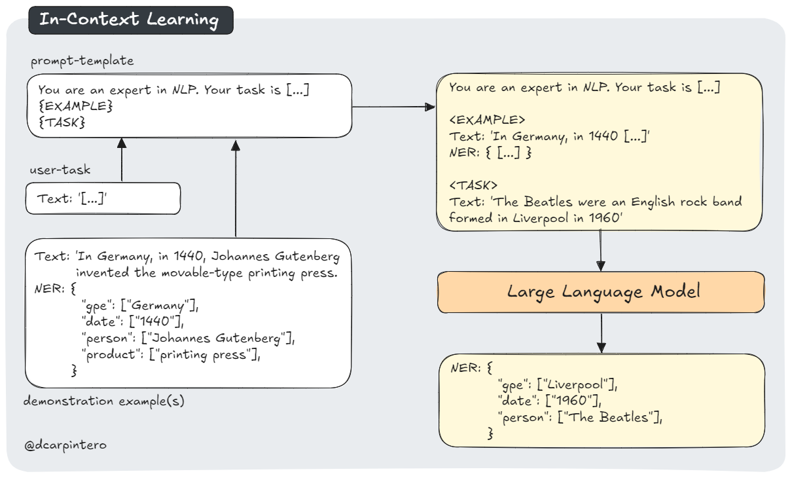
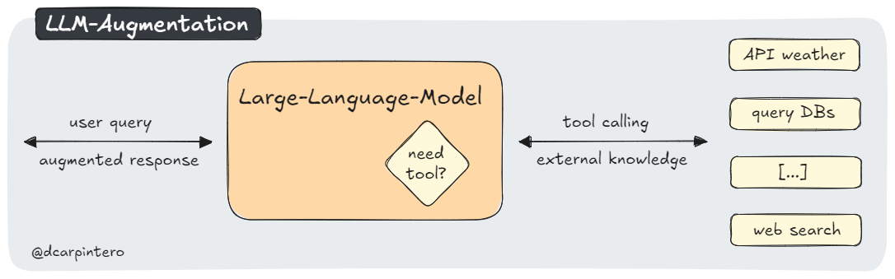
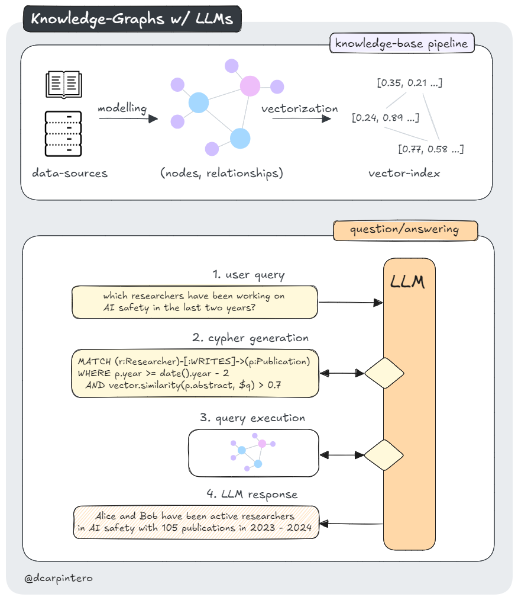

# Generative-AI-101

Annotated Notebooks to dive into foundational concepts and state-of-the-art techniques for LLMs and Diffusion models. This is a work in progress, more content will be released on a regular basis.

### TOC:
- [01. Transformers Self-Attention Mechanism](#01-transformers-self-attention-mechanism)
- [02. In-Context Learning](#01-in-context-learning)
- [03. LLM-Augmentation](#03-llm-augmentation-with-tool-integration)
- [04. Retrieval Augmented Generation](#04-retrieval-augmented-generation)
- [05. Knowledge Graphs](#05-knowledge-graphs)
- [06. Fine-Tuning BERT](#06-fine-tuning-bert)
- [07. Model Optimization: Quantization](#07-model-optimization-quantization)

## 01. Transformers Self-Attention Mechanism

 

The [Transformer](https://proceedings.neurips.cc/paper/2017/hash/3f5ee243547dee91fbd053c1c4a845aa-Abstract.html) architecture, introduced in 2017 by researchers at Google and the University of Toronto, revolutionized Natural Language Processing (NLP) with its innovative (multi-head) self-attention mechanism. This approach replaces traditional Recurrent Neural Networks (RNNs) and allows models to learn various types of contextual relationships between words regardless of their position in a sequence. By incorporating this mechanism into an encoder-decoder architecture, Transformers have significantly improved training efficiency and inference accuracy in NLP tasks.

In this notebook, we'll explore how (multi-head) self-attention is implemented and visualize the patterns that are typically learned using [bertviz](https://pypi.org/project/bertviz/), an interactive tool for visualizing attention in Transformer models:

  

Self-Attention Visualization in the BERT model

Tags: `[Transfomers]` `[Self-Attention]` `[BERT]` `[BertViz]`

## 02. In-Context Learning

 

With the increasing size and complexity of model architectures, [Large Language Models (LLMs) have demonstrated in-context learning (ICL) ability](https://splab.sdu.edu.cn/GPT3.pdf). This enables LLMs to perform tasks and generate responses based on the context provided in the input prompt, without requiring explicit fine-tuning or retraining. In practice, this context includes one or a few demonstration examples that guide (condition) the model in performing downstream tasks such as classification, question/answering, information extraction, reasoning, and data analysis.

[In 2022, researchers at Anthropic investigated the hypothesis that *'induction [attention] heads'* were the primary mechanism driving ICL](https://transformer-circuits.pub/2022/in-context-learning-and-induction-heads/index.html). These specialized units attend earlier parts of the input to copy and complete sequences, which would allow models to adapt to patterns and generate responses aligned to the provided context.

This notebook explores the concept of ICL, demonstrating its practical application in Named Entity Recognition (NER):

  

Tags: `[in-context learning]` `[named-entity-recognition]` `[function-calling]` `[openai]`

## 03. LLM-Augmentation with Tool Integration

 

LLM-augmentation with tool integration involves connecting models to external tools and APIs, allowing them to perform actions beyond text generation. This approach enables LLMs to access real-time information, execute code, query databases, and interact with other systems. In practice, models are fine-tuned to interpret user queries and determine when to use these external resources. This enables to provide more accurate, up-to-date, and actionable responses. For example, an LLM integrated with a weather API could offer current forecasts, while one connected to a code execution environment could run and debug code snippets. As a practical implementation, we will enhance the previous notebook and combine ICL for NER with LLM-augmentation to enrich a corpus with links to a knowledge base such as Wikipedia:

  

*This notebook is also available at [openai/openai-cookbook/](openai/openai-cookbook/examples/Named_Entity_Recognition_to_enrich_text.ipynb)* - *[PR#807](https://github.com/openai/openai-cookbook/pull/807)*

## 04. Retrieval Augmented Generation

Retrieval Augmented Generation (RAG) is an advanced NLP technique that enhances the quality and reliability of Large Language Models (LLMs). This approach combines information retrieval with text generation to produce more factual and specific responses. In practice, RAG works by retrieving relevant passages from a knowledge base related to a user query, augmenting the original prompt with this information, and then generating a response using both the query and the augmented context. This method offers several advantages, including improved accuracy, easy incorporation of updated knowledge, and enhanced model interpretability through citation of retrieved passages.

In this notebook, we'll build a basic knowledge base with exemplary documents, apply chunking, index the embedded splits into a vector storage, and build a conversational chain with history:

  

Tags: `[RAG]` `[Chunking]` `[FAISS]` `[Hugging Face Transformers]` `[LangChain]` `[Sentence-Transformers]` `[Groq]` `[Meta-Llama-3.1-8B]`

## 05. Knowledge Graphs

Knowledge Graphs, a form of graph-based knowledge representation, provide a method for modeling and storing interlinked information in a human - and machine - understandable format. In practice, such a graph data structure consists of *nodes* and *edges*, representing entities and their relationships. Unlike traditional databases, the inherent expressiveness of graphs allows for richer semantic understanding, while providing the flexibility to accommodate new entity types and relationships without being constrained by a fixed schema.

By combining knowledge graphs with embeddings (vector search), we can leverage *multi-hop connectivity* and *contextual understanding of information* to enhance querying, reasoning, and explainability in LLMs. This notebook explores the practical implementation of this approach, demonstrating how to (i) build a knowledge graph from academic literature, and (ii) extract actionable insights from it.

  

Tags: `[Knowledge Graphs]` `[Neo4j]` `[Contextual Reasoning]` `[Embeddings]` `[Data Modeling]` 

## 06. Fine-Tuning BERT

This notebook demonstrates the process of fine-tuning [BERT-base (Bidirectional Encoder Representations from Transformers)](https://arxiv.org/abs/1810.04805) for the Microsoft Research Paraphrase Corpus (MRPC) task, part of the [General Language Understanding Evaluation (GLUE)](https://gluebenchmark.com/) benchmark. BERT-base is a transformer model pre-trained on a large corpus of English text using self-supervised learning. Its pre-training involves two key tasks: **Masked Language Modeling (MLM)**, where it predicts randomly masked words in a sentence, and **Next Sentence Prediction (NSP)**, where it determines if two sentences are consecutive in the original text. This allows BERT to learn bidirectional representations of language, capturing complex contextual relationships.

While BERT's pre-training provides a robust understanding of language, it requires fine-tuning on specific tasks that use the whole sentence (potentially masked) such as sequence classification, token classification, question answering, and paraphrase identification - as in our implementation. In our case, this fine-tuning process adapts BERT's general language understanding (i.e. model weights) to the specific nuances of the MRPC task, which involves determining whether two given sentences are paraphrases of each other.

In this notebook, we'll walk through the steps of preparing the MRPC dataset (incl. tokenization and dynamic padding), training the model with [Hugging Face Transformers](https://huggingface.co/docs/transformers/index), and tracking its performance on the paraphrase identification task with the [Weights & Biases](https://wandb.ai/site) framework.

  

Tags: `[BERT]` `[Tokenization]` `[Dynamic-Padding]` `[Hugging Face Transformers]` `[Weights & Biases]` `[GLUE]` 

## 07. Model Optimization: Quantization

Quantization is a technique used in the optimization of LLMs. It reduces the precision of the model's parameters, effectively shrinking its size and computational requirements, while aiming to maintain its performance. The intuition behind Quantization is that we can discretize floating-point values by mapping their range [f_max, f_min] into a smaller range of fixed-point numbers [q_max, q_min], and linearly distributing all values between these ranges. 

In this notebook, we introduce how quantization works specifically for LLMs with a practical implementation of dynamic quantization on a BERT model. We will then benchmark it in terms of model size reduction, quantization analysis, inference latency, and accuracy preservation:

  

Tags: `[Model Optimization]` `[Quantization]` `[Calibration]` `[Benchmark]`